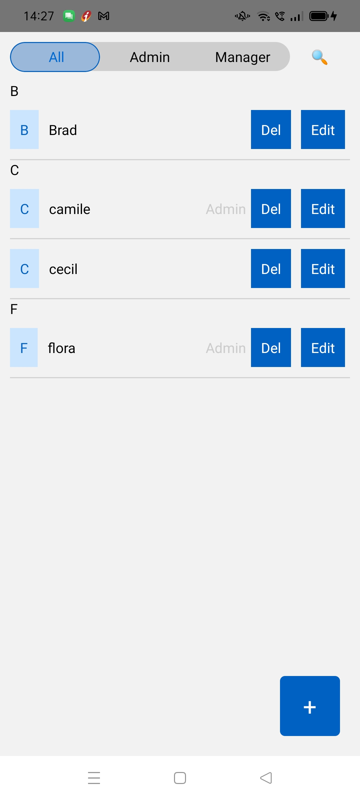
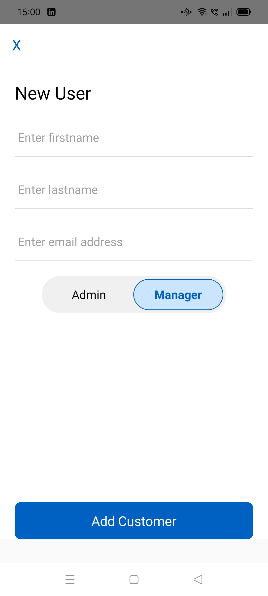
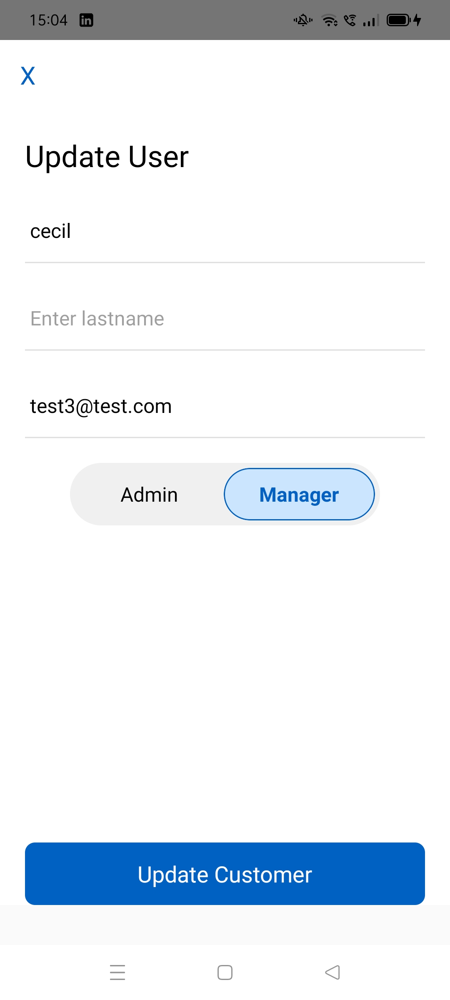

# Zeller React native app

A React Native application for managing Zeller customers with offline support and smooth animation

## features

- Cross-platform
- Graphql API integration with offline support
- Local SQLlite database for offline usage
- Smooth tab animations with pager view
- Search and filter functionality
- Form validation
- Pull to refresh functionality
- Unit tests

## Tech stack

- **React Native** 0.83.1 with TypeScript
- **Apollo client** for Graphql
- **SQLite** for local database
- **React-native-animation** for animations
- **Pager View** for tab swiping
- **Jest, react-testing-library** for testing

## PreRequisite

- Node.js >= 20.19.4
- React native CLI
- Xcode (IOS)
- Android Studio(Android)

## Setup Instructions

## 1. install dependecies
````base
    cd ZellerApp
    npm install
````

## 2. iOS Setup

````bash
    cd ios && pod install && cd ..
````

## Start Metro Bundler

````bash
npm start
````

## Run the App

For iOS:
````bash
npm ios
````

For Android:
````bash
npm andoid
````

## Mock Server Setup

The app connects to a GraphQL mock server. To start it:

````
cd ../mock-server
npm install
npm start
````

The mock server will run on `https://localhost:90002/graphql`

in case runing app on device replace localhost with laptop's IP address


## Project structure

````
├── App.tsx
├── components  # Reusable UI components
│   ├── Button.tsx
│   ├── FormButtonGroup.tsx
│   ├── FormTextInput.tsx
│   └── withFormField.tsx
├── screens # Screes with all related logic and tests
│   ├── AddCustomer
│   │   ├── AddCustomer.hook.test.ts
│   │   ├── AddCustomer.hook.ts
│   │   ├── AddCustomer.screen.test.tsx
│   │   └── AddCustomer.screen.tsx
│   ├── CustomerList
│   │   ├── CustomerCard.component.test.tsx
│   │   ├── CustomerCard.component.tsx
│   │   ├── CustomerList.hook.test.ts
│   │   ├── CustomerList.hook.ts
│   │   ├── CustomerList.screen.test.tsx
│   │   ├── CustomerList.screen.tsx
│   │   ├── tabAnimation.hook.test.ts
│   │   └── tabAnimation.hook.ts
│   └── EditCustomer
│       ├── EditCustomer.hook.test.ts
│       ├── EditCustomer.hook.ts
│       ├── EditCustomer.screen.test.tsx
│       └── EditCustomer.screen.tsx
├── services # API, external service, local database
│   ├── database
│   │   └── DatabaseService.ts
│   └── GraphQL.Service.ts
├── theme # UI design system configurations
│   └── colors.ts
├── types # Typescript types, enum and interfaces
│   └── index.ts
└── utils # utility functions
    └── stringsUtils.ts
````


## Key Features implementation

### 1. Data integration

- Fetches data from GraphQl API using Apollo client
- stores data locally in SQLite database
- Displays data from local database for offline support

### 2. User Management

- Add new user with form validation
- update and delete users from local database

### 3. Filter and Search

- Filter by user type(All, Admin, Manager)
- text search by customer name

## Testing

Run tests: 
````bash
    npm run test
````

Run tests with Coverage

````bash
    npm run test ---coverage
````

  
  
  